# bookstore5_be

## 介绍

因为前后端分离，后端只用`servlet`没有`jsp`。使用了`fastjson`和`auth0-jwt`

## 技术栈

- Java 17.0.5 64-Bit
- Tomcat 10.1.2
- MySQL 5.7.35-log
- com.alibaba.fastjson2:fastjson2 2.0.19
- com.auth0:java-jwt3 4.2.1
- mysql:mysql-connector-java 8.0.30

## 项目结构

- `controller` 中是响应请求的处理逻辑
- `model` 中是用到的数据结构和对象相关的方法
- `utils` 中是一些工具类，封装了一套返回数据结构
- `database` 中封装了基础的数据库操作

## 项目接口

**接口文档地址：[https://www.apifox.cn/web/project/2212722](https://www.apifox.cn/web/project/2212722)**
**建议下载`apifox`进行调试**

- 所有的接口返回的都是`json`格式的数据
- GET方法接收的数据采用`query`参数，`POST`，`PUT`，`DELETE`方法接收的数据采用`json`格式
- 鉴权使用`jwt`，需要鉴权的请求中被携带在头部`Authorization`字段中，具体可以打开`devtools`或者`apifox`查看
- 如果出现调用上的错误会返回400，如发送的数据不完整，或者数据格式错误等
- 如果`jwt token`验证失败会返回401，此时需要重新登录获取新的`token`
- 如果有500，我是没有遇到过，建议`debug`完叫我一下
- 推荐前端使用`fetch`函数进行`ajax`请求。

### 接口列表（省略/api前缀）

| 请求方式   | 接口                                          | 说明         | 状态                |
|--------|---------------------------------------------|------------|-------------------|
| POST   | /register                                   | 注册         | ✅                 |
| POST   | /login                                      | 登录         | ✅                 |
| GET    | /book/show?isbn={isbn}                      | 获取书籍详细信息   | ✅                 |
| DELETE | ~~/book?isbn={isbn}~~                       | ~~删除书籍~~   | ❌被废弃👇            |
| PUT    | ~~/book~~                                   | ~~修改书籍信息~~ | ❌被废弃👇            |
| POST   | ~~/book~~                                   | ~~添加书籍~~   | ❌被废弃👇            |
| GET    | ~~/booklist/page?page={page}~~              | ~~获取书籍列表~~ | ❌被废弃👇            |
| PUT    | ~~/booklist?isbn={isbn}~~                   | ~~添加到书单~~  | ❌被废弃：用户购物车现在是前端缓存 |
| DELETE | ~~/booklist?isbn={isbn}~~                   | ~~从书单中删除~~ | ❌被废弃：用户购物车现在是前端缓存 |
| GET    | ~~/booklist/search?keyword={keyword}~~      | ~~搜索书籍~~   | ❌被废弃👇            |
| GET    | /goods/list?page={page}                     | 获取书籍列表     | ✅                 |
| GET    | /goods/search?keyword={keyword}&page={page} | 搜索书籍       | ✅                 |
| GET    | /user/info                                  | 获取用户信息     | ✅                 |
| PUT    | /user/info                                  | 修改用户信息     | ✅                 |
| PUT    | /user/password                              | 修改密码       | ✅                 |
| GET    | /order/list?page={page}                     | 获取订单列表     | 🤡未做              |
| GET    | /order/purchase?isbn={isbn}                 | 购买前信息展示    | ✅                 |
| POST   | /order/purchase?isbn={isbn}                 | 购买书籍       | ✅                 |
| GET    | /order/show?serial={serial}                 | 查看订单状态     | 🤡未做              |
| POST   | /order/finish?serial={serial}               | 完成订单       | 🤡未做              |
| DELETE | /manage/stock?isbn={isbn}                   | 删除书籍       | ✅                 |
| PUT    | /manage/stock                               | 修改书籍信息     | ✅                 |
| POST   | /manage/stock                               | 添加书籍       | ✅                 |
| GET    | /manage/order/list?page={page}              | 店员获取订单列表   | 🤡未做              |
| GET    | /manage/order/show?serial={serial}          | 店员获取订单状态   | 🤡未做              |
| POST   | /manage/order/process?serial={serial}       | 店员审核和发货    | 🤡未做              |
| GET    | /admin/statistics                           | 店长获取统计信息   | 🤡未做              |

## 数据库配置

1. 打开一个`MySQL Command Line`客户端，输入用户名密码
   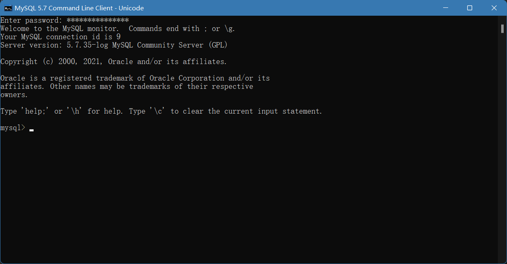
2. 运行```CREATE DATABASE `bookstore` CHARACTER SET 'utf8mb4' COLLATE 'utf8mb4_unicode_ci';```创建数据库
3. 运行```use bookstore;```选择数据库
4. 找到项目根目录下面的`bookstore.sql`文件夹，运行```source D:\code\bookstore4_be\bookstore.sql```导入数据库
   > 注意，这里的路径要是你的项目实际路径
5. （可跳过）运行```CREATE USER `crud`@`%` IDENTIFIED WITH mysql_native_password BY 'ssr129631';```创建用户
6.

（可跳过）运行```GRANT Alter, Alter Routine, Create, Create Routine, Create Temporary Tables, Create View, Delete, Drop, Event, Execute, Grant Option, Index, Insert, Lock Tables, References, Select, Show View, Trigger, Update ON `bookstore`.* TO `crud`@`%`;```
为他授予数据库权限

7. 去`src/Config.java`修改一下你的数据库配置，比如多数人的端口是`3306`
   ，和我的默认配置不一样。如果你跳过了上面两步，可以把账号密码设置成`root`用户直接连接。
   
8. 已经结束了，大的还在后头

## 项目运行

1. `git clone`下来一个干净的文件夹
   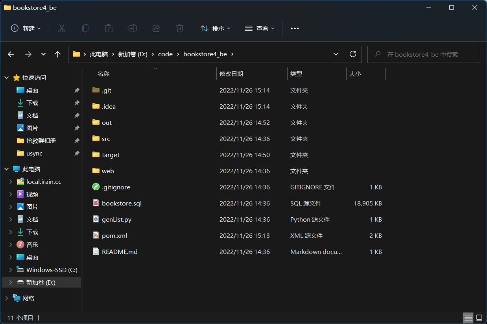
2. 删除`.idea`文件夹，日他仙人
   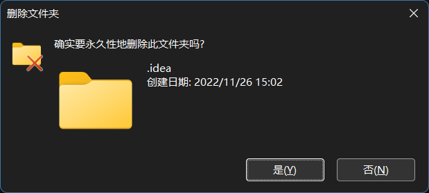
3. 打开项目，观察到`maven`已经正确下载了依赖
   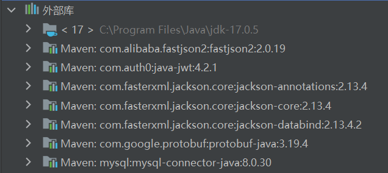
4. 在`web/WEB-INF`下创建文件夹`classes`和`lib`
5. 在工具栏打开文件→项目结构→模块→路径
6. 选择使用模块编译输出路径，并且设置目录为刚刚创建的`classes`
   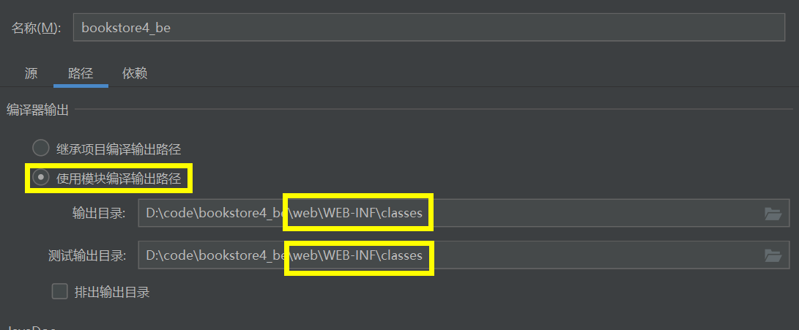
7. 切换到依赖选项卡，把所有`maven`依赖打勾，并且把范围都设置成编译
   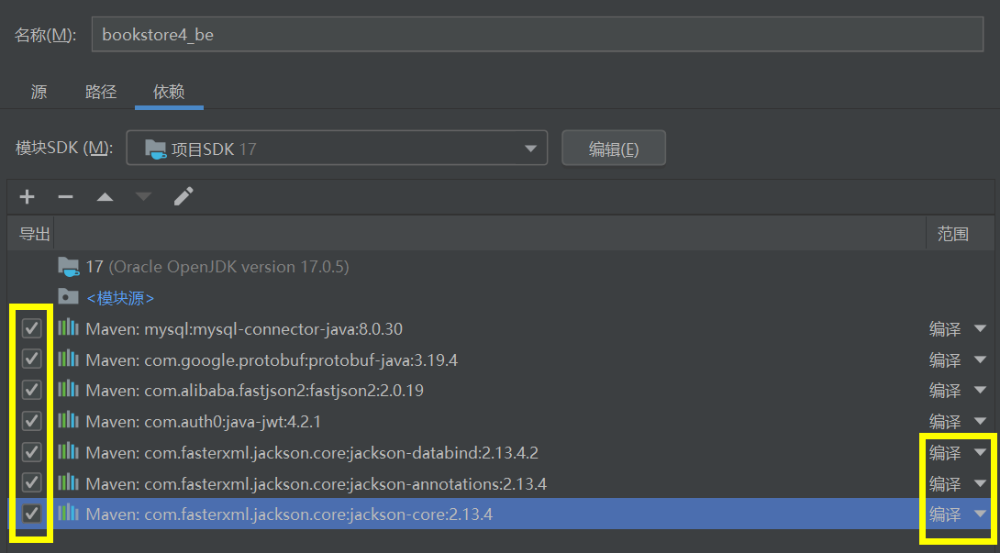
8. 点击左上角加号，选择添加`JAR`或目录
   
9. 选择本机`tomcat`目录下的`lib`文件夹，不是刚刚创建的那个`lib`
   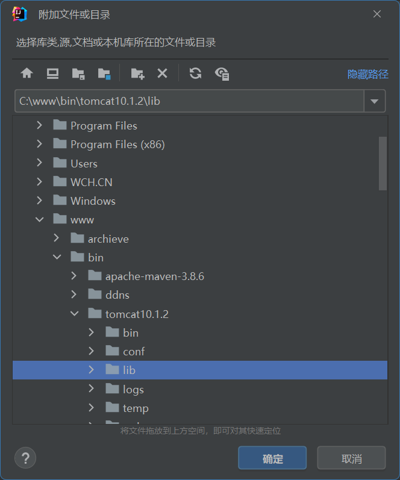
10. 切换到`Facet`选项卡，点击加号，选择`web`，点击确认
    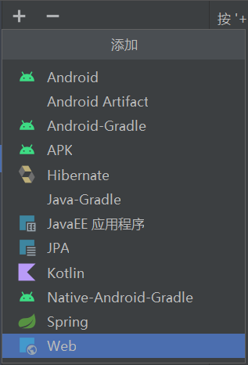
11. 右下角出现警告，点击创建工件，跳转到工件选项卡
    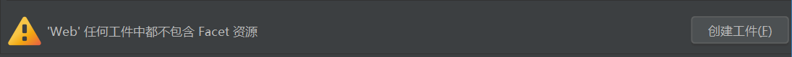
12. 选中右侧所有的可选依赖，右键选择置于`/WEB-INF/lib`
    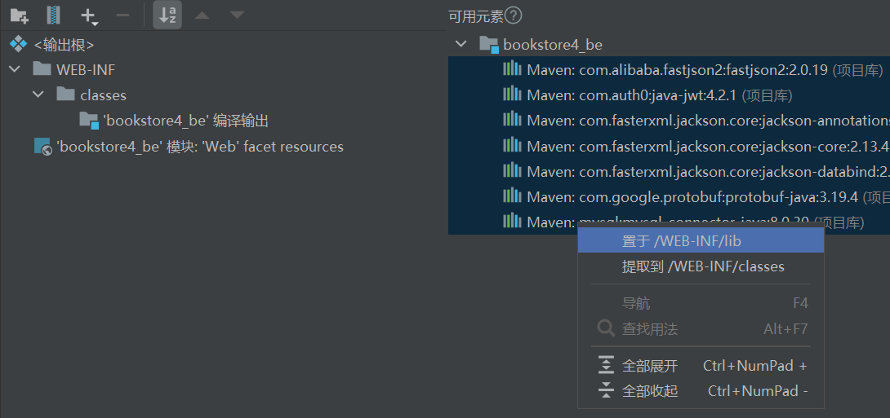
13. 大功告成，点击应用并退出
14. 添加一个运行配置，大概像我这样
    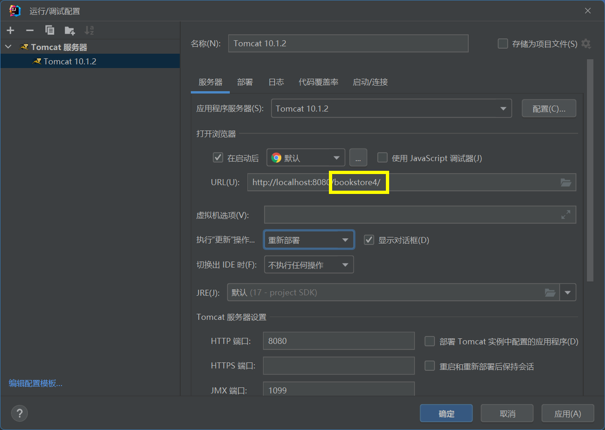
    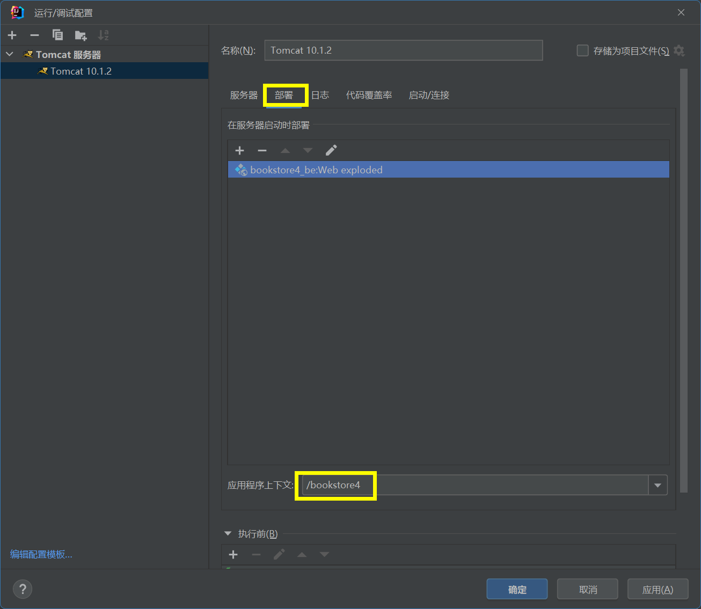
15. 运行，如果弹出浏览器访问显示404是正常的，因为/并没有对应的`servlet`
    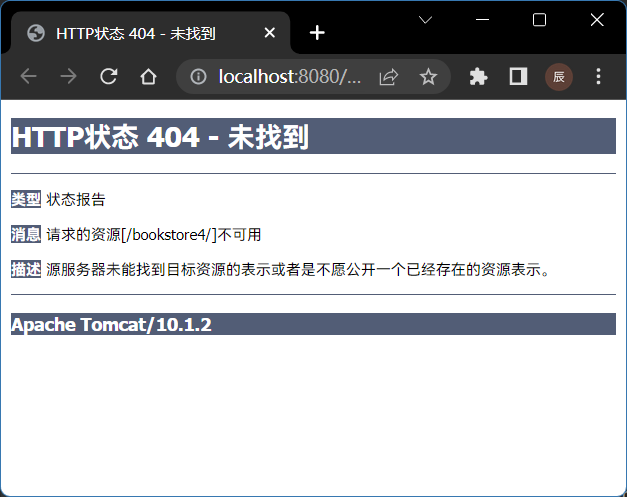
16. 相关请求`api`都在`apifox`
    里面，请求路径以[http://127.0.0.1:8080/bookstore4_be/api/](http://127.0.0.1:8080/bookstore4_be/api/)
    开头,如[http://127.0.0.1:8080/bookstore4/api/login](http://127.0.0.1:8080/bookstore4/api/login)
    ，[http://127.0.0.1:8080/bookstore4/api/booklist/page?page=1](http://127.0.0.1:8080/bookstore4/api/booklist/page?page=1)

## 使用APIFOX进行测试

1. 访问[https://www.apifox.cn/](https://www.apifox.cn/)，注册一个账号，下载客户端
2. 访问项目地址[https://www.apifox.cn/web/project/1958328](https://www.apifox.cn/web/project/1958328)，点击项目设置并登录
3. 登陆后来到项目操作，选择克隆项目
   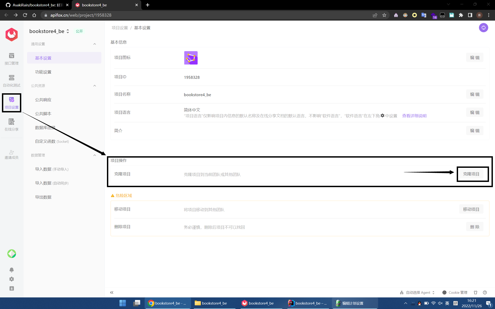
4. 选择你自己的团队（比如示例团队），然后确认
   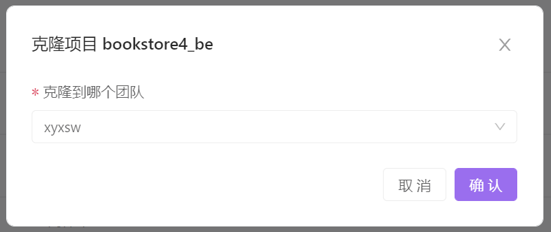
5. 打开的桌面客户端，你应该能找到克隆过来的项目，如果没有，点一下软件右上角的刷新
   
6. 你可以随时点击左上角的项目名称来切换团队和项目
   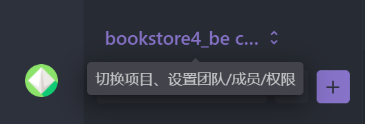
7. 左侧接口列表显示了所有的接口，可以点击三角形展开接口分组和数据模型
   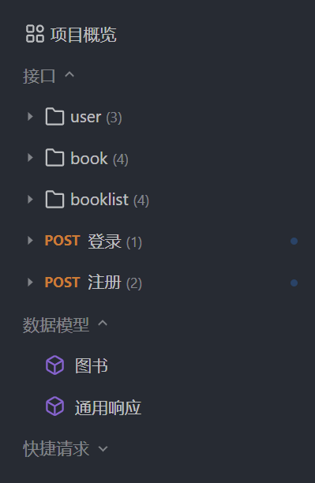
8. 先配置一个测试环境，点击右上角的云端`MOCK`下拉菜单，展开环境配置，选择测试环境
   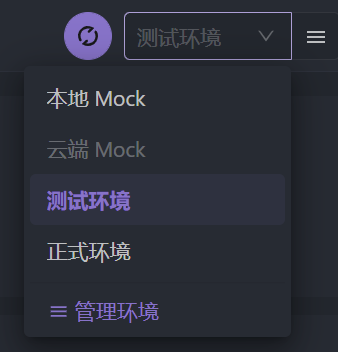
   > 如果你的`tomcat`不在8080端口，或者你在idea中配置的请求上下文路径和教程不一样，就需要进入管理环境按照实际情况填写
9. 现在打开后端服务器，点击登录接口左侧的三角并选择成功用例
   
   可以看到成功用例自动填入了`body`请求体，请求链接等
10. 点击发送，查看返回值是否符合预期
    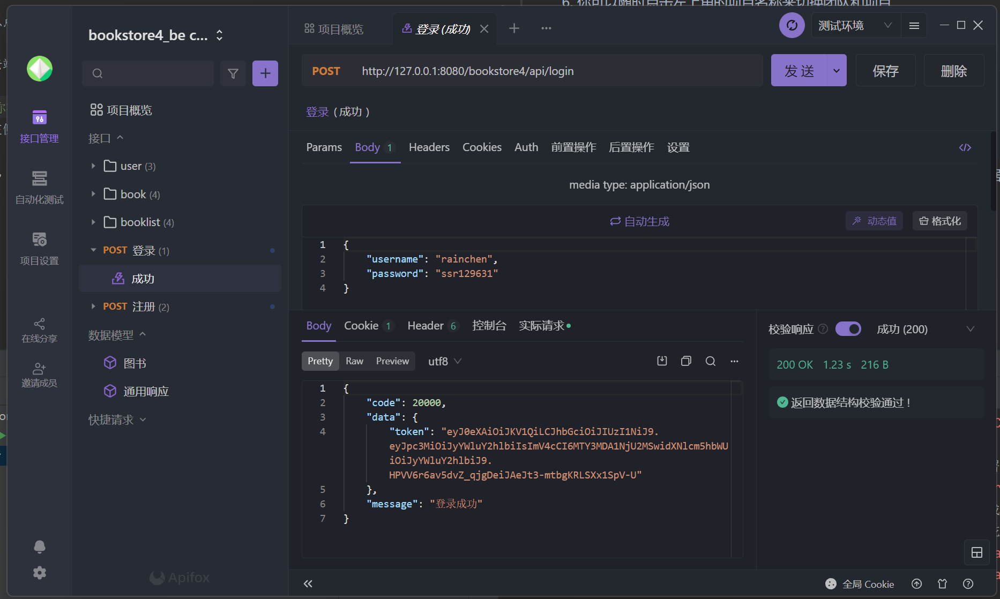
11. 此外，你可以切换到各个接口来查看接口文档，或者修改文档